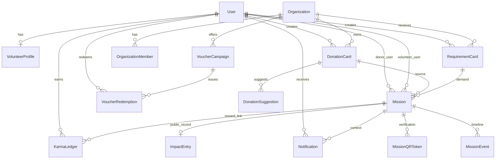
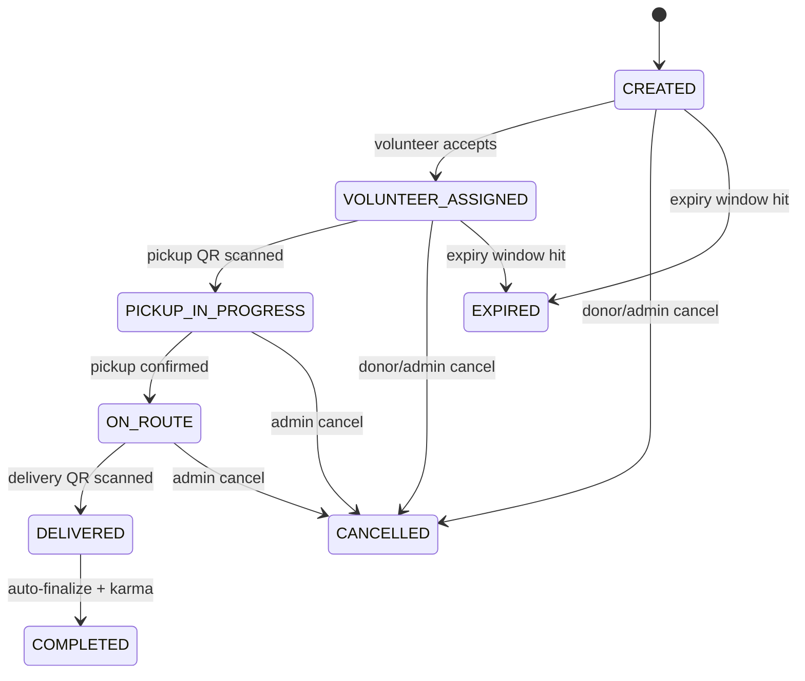

# MealBridge - Startup Architecture & Implementation Blueprint

## 1) Platform Architecture

MealBridge is built as a role-aware mission orchestration platform where every food transfer is modeled as a **Mission Event Workflow**.

### System Layers

- **Frontend (React + Vite + Tailwind + Axios)**
- **Backend API (Django + DRF + JWT)**
- **Database (PostgreSQL on Supabase)**
- **Integrations**
  - Twilio WhatsApp API for radius-based mission alerts
  - Google Maps Distance Matrix API for ETA predictions

### High-Level Runtime Flow

1. Donor creates donation card or fulfills NGO requirement.
2. Backend creates mission in `CREATED` state and logs timeline event.
3. Nearby volunteers are found using geolocation radius logic.
4. WhatsApp alerts are sent to nearby volunteers, in-app notifications to others.
5. Volunteer accepts mission and receives Pickup QR token.
6. Pickup scan transitions mission toward transport, Delivery QR is generated.
7. Delivery scan closes mission, awards karma, publishes to impact feed.

---

## 2) Full Project Folder Structure

```txt
MealBridge/
  backend/
    manage.py
    requirements.txt
    config/
      __init__.py
      settings.py
      urls.py
      asgi.py
      wsgi.py
    apps/
      __init__.py
      common/
        __init__.py
        apps.py
        models.py
        migrations/
      accounts/
        __init__.py
        apps.py
        models.py
        serializers.py
        views.py
        migrations/
      organizations/
        __init__.py
        apps.py
        models.py
        migrations/
      donations/
        __init__.py
        apps.py
        models.py
        serializers.py
        views.py
        migrations/
      requirements/
        __init__.py
        apps.py
        models.py
        serializers.py
        views.py
        migrations/
      missions/
        __init__.py
        apps.py
        models.py
        serializers.py
        views.py
        migrations/
      notifications/
        __init__.py
        apps.py
        models.py
        serializers.py
        views.py
        migrations/
      rewards/
        __init__.py
        apps.py
        models.py
        serializers.py
        views.py
        migrations/
      impact/
        __init__.py
        apps.py
        models.py
        serializers.py
        views.py
        migrations/
    services/
      __init__.py
      geo.py
      eta.py
      mission_flow.py
      notifications.py
      qr.py
      rewards.py
    tests/
  frontend/
    package.json
    vite.config.js
    tailwind.config.js
    postcss.config.js
    index.html
    src/
      main.jsx
      app/
        App.jsx
        router.jsx
      layouts/
        AppShell.jsx
        AuthLayout.jsx
      pages/
        LandingPage.jsx
        auth/
          LoginPage.jsx
          RegisterPage.jsx
        dashboard/
          DashboardPage.jsx
        feed/
          DonationFeedPage.jsx
          RequirementFeedPage.jsx
          ImpactFeedPage.jsx
        missions/
          MissionDetailPage.jsx
          VolunteerMissionsPage.jsx
          CreateDonationPage.jsx
          CreateRequirementPage.jsx
        rewards/
          RedeemRewardsPage.jsx
          BusinessVoucherPage.jsx
        profile/
          ProfilePage.jsx
      components/
        ui/
          Panel.jsx
        cards/
          MissionCard.jsx
          RequirementCard.jsx
        missions/
          MissionTimeline.jsx
        maps/
          MapPlaceholder.jsx
        notifications/
          NotificationPanel.jsx
      services/
        apiClient.js
        missionService.js
        feedService.js
      hooks/
        useAuth.js
      utils/
        formatters.js
      styles/
        index.css
  docs/
    MEALBRIDGE_ARCHITECTURE.md
```

---

## 3) Django Models & Schema Design

### Core Domain Models

- `accounts.User` (role-based actor: DONOR, VOLUNTEER, RECEIVER, ADMIN)
- `accounts.VolunteerProfile` (availability, vehicle, karma points)
- `organizations.Organization` (donor business or NGO, verification)
- `organizations.OrganizationMember` (membership map)
- `donations.DonationCard` (soft-deletable donor card)
- `donations.DonationSuggestion` (distance-ranked nearby NGOs)
- `requirements.RequirementCard` (NGO need post, urgency)
- `missions.Mission` (stateful donor->volunteer->receiver transfer)
- `missions.MissionEvent` (immutable timeline log)
- `missions.MissionQRToken` (pickup/delivery anti-fraud checkpoints)
- `notifications.Notification` (WhatsApp + in-app delivery record)
- `rewards.KarmaLedger` (point issuance ledger)
- `rewards.VoucherCampaign` (business donor offers)
- `rewards.VoucherRedemption` (unique code generation)
- `impact.ImpactEntry` (public completion feed card)

### Soft Deletion and Card Ownership

`DonationCard` and `RequirementCard` store:

- `created_by`
- `created_at`
- `status` in: `ACTIVE | FULFILLED | CANCELLED | EXPIRED`

No hard delete is required in normal workflows.

---

## 4) REST API Endpoints (DRF)

Base path: `/api/v1/`

### Auth

- `POST /auth/register/`
- `POST /auth/login/`
- `GET /auth/me/`

### Donation Cards

- `GET /donations/`
- `POST /donations/`
- `GET /donations/{id}/`
- `PATCH /donations/{id}/`
- `POST /donations/{id}/update_status/`
- `POST /donations/{id}/create_mission/`

### Requirement Cards

- `GET /requirements/`
- `POST /requirements/`
- `GET /requirements/{id}/`
- `PATCH /requirements/{id}/`
- `POST /requirements/{id}/fulfill/`

### Missions

- `GET /missions/`
- `POST /missions/`
- `GET /missions/{id}/`
- `POST /missions/{id}/accept/`
- `POST /missions/{id}/scan_pickup/`
- `POST /missions/{id}/scan_delivery/`
- `POST /missions/{id}/cancel/`

### Notifications

- `GET /notifications/`
- `GET /notifications/{id}/`

### Rewards

- `GET /vouchers/campaigns/`
- `POST /vouchers/campaigns/`
- `GET /vouchers/redemptions/`
- `POST /vouchers/redemptions/`

### Impact Feed

- `GET /impact-feed/` (public)

---

## 5) React Component Architecture

### App Composition

- `router.jsx` is route shell and page map.
- `AppShell.jsx` is authenticated app frame.
- `AuthLayout.jsx` is focused auth container.

### Page Modules

- Landing, Authentication, Dashboard
- Donation Feed, Requirement Feed, Impact Feed
- Mission Detail, Volunteer Missions, Create Donation, Create Requirement
- Redeem Rewards, Business Voucher, Profile

### Reusable Components

- `Panel` for all cards/containers
- `MissionCard` and `RequirementCard` for feed rows
- `MissionTimeline` for event history
- `MapPlaceholder` for Google Maps integration area
- `NotificationPanel` for in-app alerts

### Data Layer

- `apiClient.js` handles JWT and base API config.
- `missionService.js` and `feedService.js` centralize endpoint calls.
- `useAuth.js` stores/retrieves auth session.

---

## 6) Database Schema Diagram (ERD)



---

## 7) Mission Lifecycle Diagram (State Machine)



### Timeline Event Logging

Every transition writes a `MissionEvent` row with:

- timestamp
- actor
- event type
- message
- metadata JSON

---

## 8) Geolocation, ETA, and Notification Workflow

### Volunteer Matching

- `services.geo.volunteers_within_radius()` calculates distance with Haversine.
- Missions default to an 8 km primary alert radius.
- Nearby set -> WhatsApp or in-app.
- Outside radius -> in-app backlog notification.

### ETA

- `services.eta.estimate_eta_minutes()` uses Google Distance Matrix.
- ETA fields on mission:
  - `pickup_eta_minutes`
  - `delivery_eta_minutes`

### Notification Channels

- `Notification.channel = WHATSAPP | IN_APP`
- Twilio outbound status is persisted (`PENDING | SENT | FAILED`).

---

## 9) QR Verification Anti-Fraud Design

Two active tokens max per mission lifecycle:

1. `PICKUP` QR generated on volunteer assignment
2. `DELIVERY` QR generated after pickup scan

Token rules:

- one-time use
- active flag invalidates replay
- scanned actor + timestamp stored
- invalid token blocks transition

---

## 10) Karma & Voucher Economy

### Karma Rules

- Completed delivery: `+10`
- Urgent requirement: `+15`
- Night completion (22:00-06:00): `+20`

All points are immutable ledger entries in `KarmaLedger`.
`VolunteerProfile.karma_points` is updated from ledger sum.

### Voucher Redemptions

- Donor businesses create campaigns with `required_karma`.
- Volunteer redeems -> unique code generated (e.g. `GLR-92XK-81LP`).
- One redemption per campaign per user.

---

## 11) Scalability and Production Hardening Plan

### Phase 1 - Foundation (current scaffold)

- Role-based API and mission lifecycle core
- Timeline logging and QR verification
- Initial React shell and route-level pages

### Phase 2 - Reliability

- Add Celery + Redis for async notifications and expiry jobs
- Retry and dead-letter handling for Twilio failures
- Add Redis mission-locking for concurrent volunteer accept race

### Phase 3 - Data & Performance

- Read replicas and query indexing on mission state/time fields
- Materialized view for impact feed
- Caching layer for NGO suggestions and hotspot areas

### Phase 4 - Trust & Compliance

- NGO verification workflow with document evidence
- Audit logs for admin moderation actions
- Signed media URLs and PII handling policy

### Phase 5 - Product Growth

- Partner analytics dashboard
- Referral + gamification extensions
- Multi-city operational configuration

---

## 12) UI Direction (Minimal Startup-Grade)

Implemented style principles in scaffold:

- Neutral palette, low-noise cards, restrained accents
- Rounded 14px card geometry
- Soft depth shadows, no flashy gradients in app shell
- Strong spacing rhythm with readable typography
- Mobile-safe responsive route layouts

This keeps the interface close to Stripe/Notion operational clarity instead of generic colorful dashboard patterns.